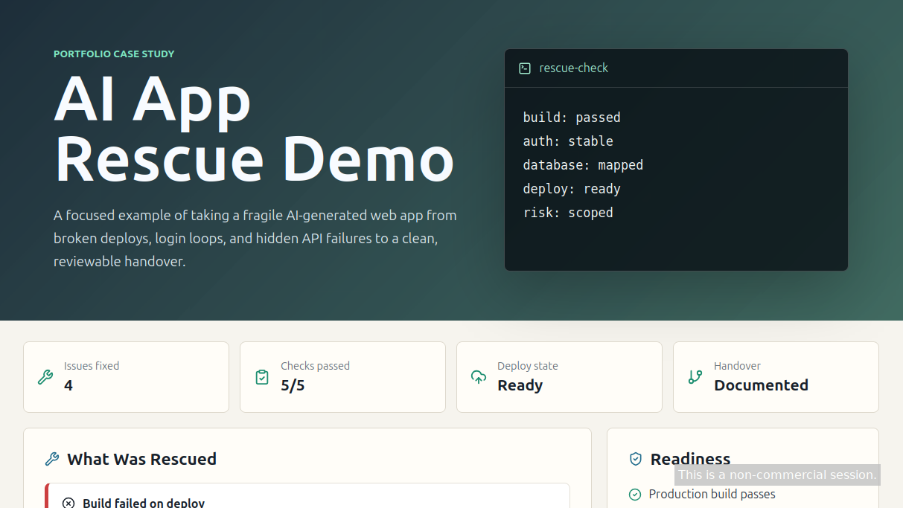
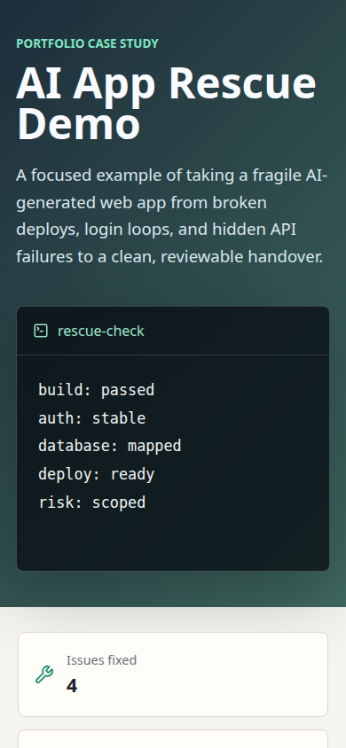

# AI App Rescue Demo

Portfolio demo for fixing and stabilizing broken AI-generated or fast-built web apps.

## Live Demo

Live app: https://apprescuedev.github.io/app-rescue-demo/

Source repo: https://github.com/AppRescueDev/app-rescue-demo

Before/after proof:

- `main` is the clean, working version.
- `broken-start` is the intentionally broken starting branch.

## Screenshots

Desktop:



Mobile:



## What This Demonstrates

This project shows the kind of work offered by the Fiverr `AppRescueDev` profile: diagnosing broken builds, auth issues, database/API problems, deployment failures, and messy responsive layouts.

## Demo Story

The fictional client had an AI-generated app that looked close in preview but failed once deployed. The rescue process focuses on:

- finding the real cause of build and deploy errors
- stabilizing login/session behavior
- documenting database and environment requirements
- cleaning up user-facing layout issues
- giving the client clear handover notes

## Tech Stack

- React
- TypeScript
- Vite
- lucide-react

## Run Locally

```bash
npm install
npm run dev
```

## Build Check

```bash
npm run build
```

## Portfolio Note

This is a self-contained demo. It does not include client code, private business branding, or Schweet Web assets.
